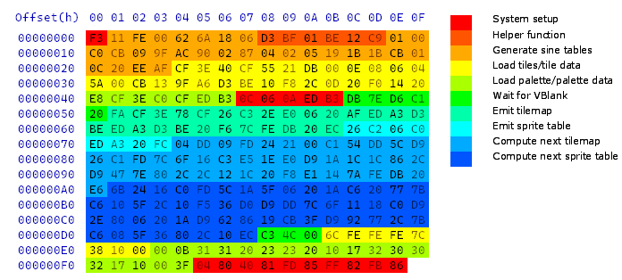

Rise and Sine disassembly
=========================

[Rise and Sine](https://www.pouet.net/prod.php?which=96109) was a 255 byte size-coding competition entry by Darklite, coded by Neon, released at Lovebyte 2024.

This is a disassembly of it that I made in order to understand how it works. The code remains copyrighted by the original authors until they choose to release it, but the comments are all mine.

Here's a graphical breakdown of the ROM use:

Here's a graphical breakdown of the frame time use:

It's very close to the limit! I was unable to find any significant speed optimisations.